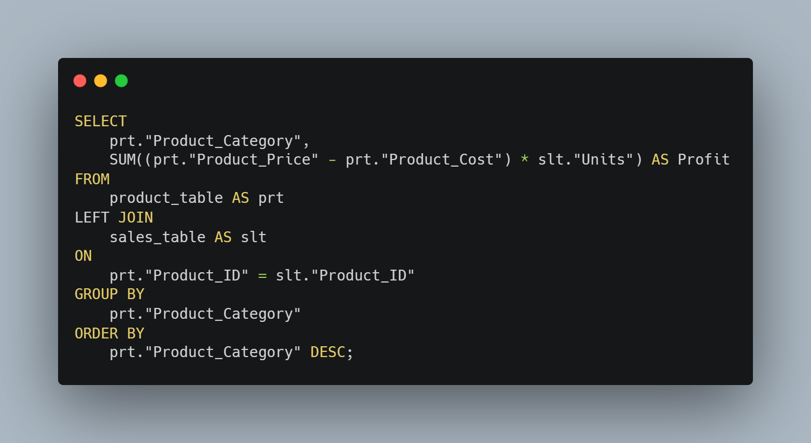
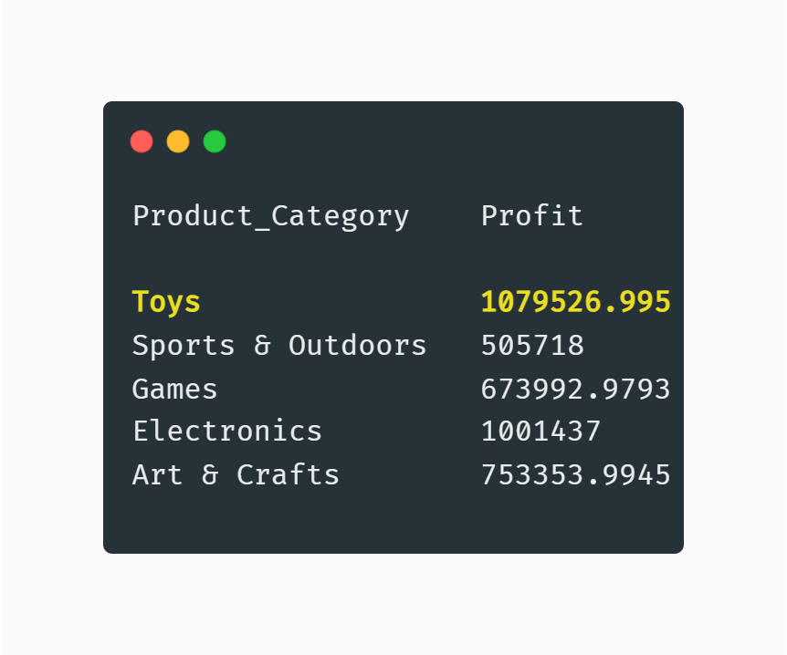
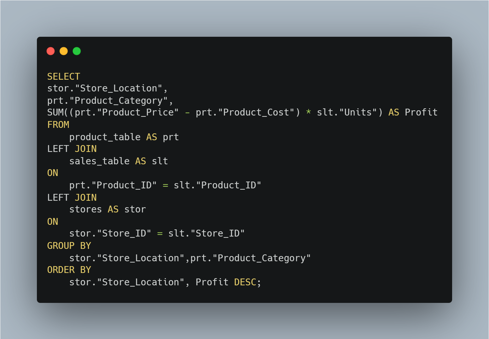
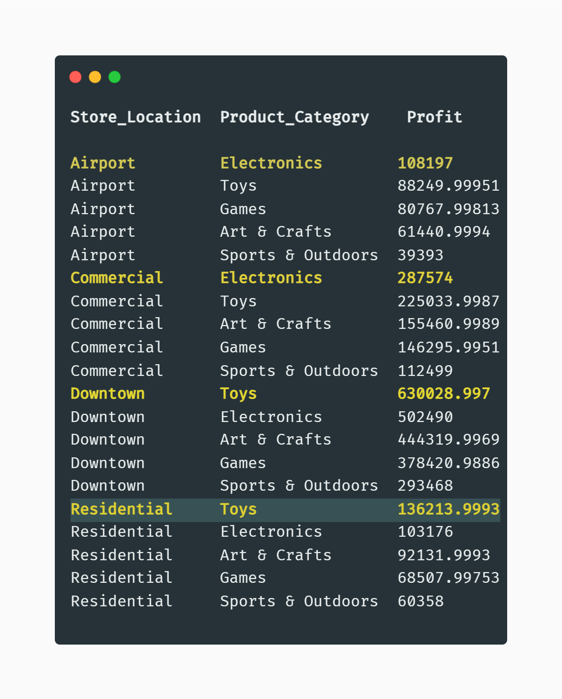
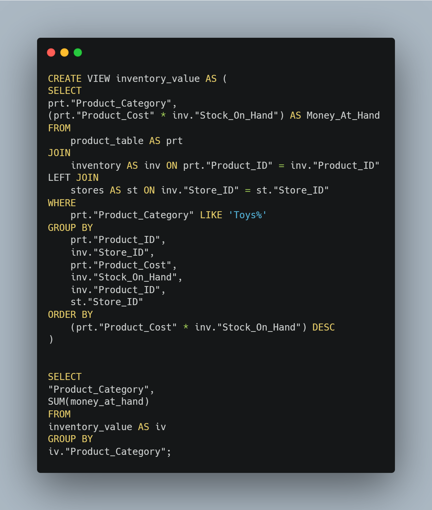
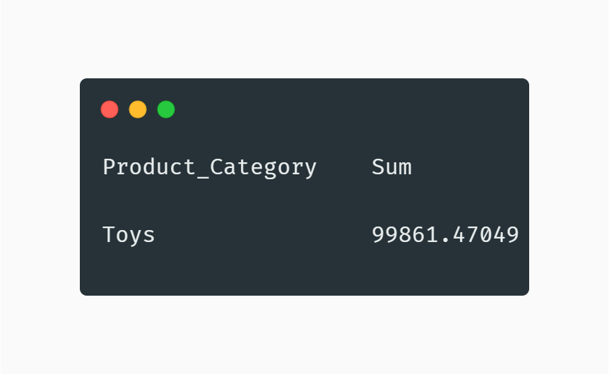
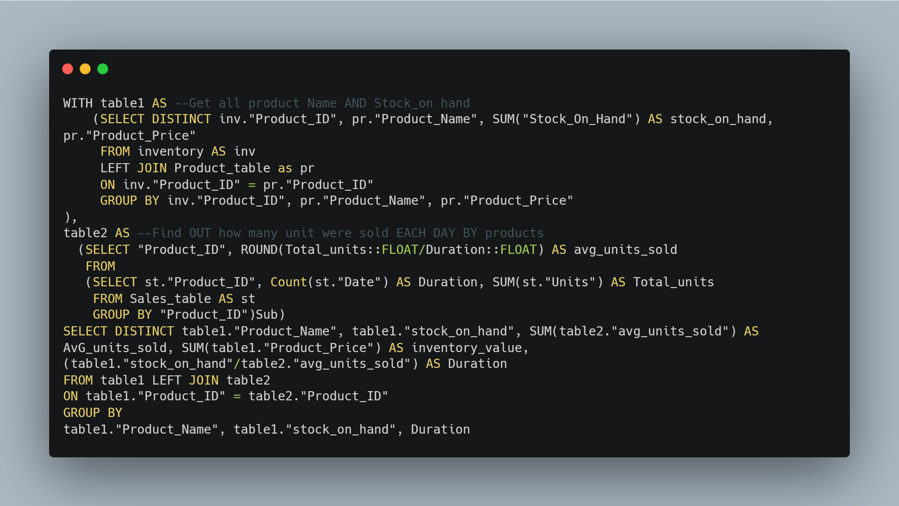
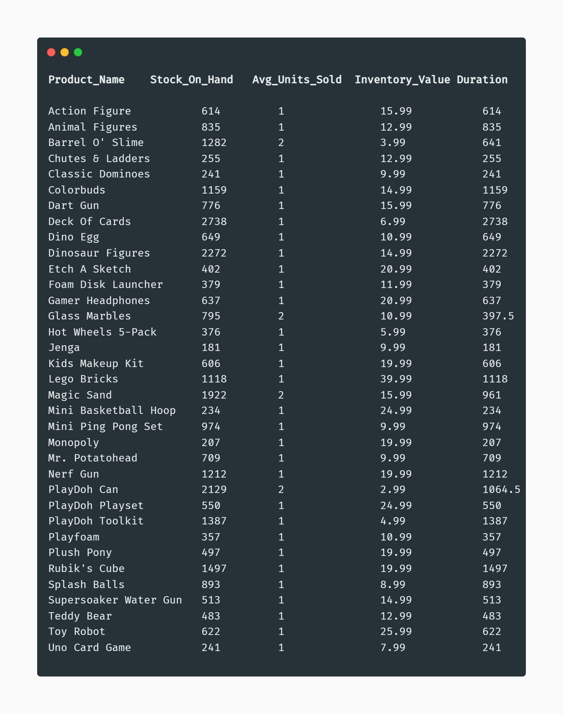

# Mavin_Toys_Sales_and_Inventory-Audit_with_Postgresql

## Introduction
This project represents sales and inventory data manipulation for Mavin chain of toys. 
The data contain information such as products, stores, daily sales transactions, and inventory level for each store location.

## Problem Statement
In this project, data manipulation will be done to answer the business set questions, this includes:

- What product categories drive the biggest profits?  Is this the same across store locations?
- How much money is tied up in inventory at the toy stores?  How long will it last?

## Data Source
UTIVA

## Data Transformation
Creating Database
- This project made use of Postgresql to create 4 tables with correct data types using both query and GUI method
- Loading data into the tables created.

## Data Manipulation:

- ### Product Categories with the Biggest Profit

The product category “Toy” is seen as the product with the highest profit from the below query.

Query                                   | Output
----------------------------------------|----------------------------------------
   | 

- ##### Product with Profit across locations

To get the biggest profit across different locations the below reflects that although “Toy” product category is the product category with the biggest profit, it is not the biggest profit by different location product category “Electronics” is equally the biggest profit in other locations.

Query                                   | Output
----------------------------------------|----------------------------------------
  | 

- ### Toy Stores Inventory Value

The below query creates a virtual table (inventory value) that stores each of all toy stores' values from different stores. The second query sum up all the value to get the inventory value of all Toy Stores, which is approximately $99,861.

Query                                   | Output
----------------------------------------|----------------------------------------
    | 

- ##### Duration

To know how long the inventory value will last, the query below created 2 virtual tables 1 -2. Table_1 had information on products and stock on hand, the table_2 has details of average units sold per product in a day. To get the duration of inventory value, the product stock at hand is divided by the average units sold. This gives us the duration of when the stock can last.

Query                                   | Output
----------------------------------------|----------------------------------------
       | 

## Skills Demonstrated
- Data analysis
- Data manipulation.
- Data wrangling.

Thank you for your time.🤝
